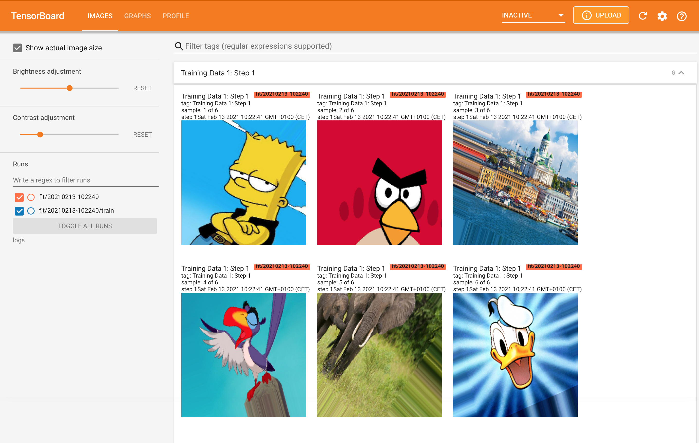
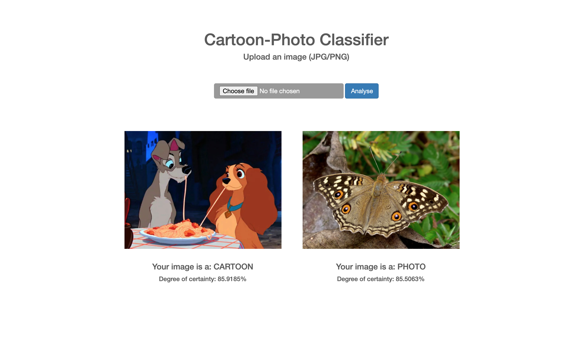

# Cartoon-Photo Classifier

This repository contains the code for the generation and deployment of Tensorflow-Keras-based deeplearning convolutional neural networks (CNNs) to predict whether an image is a cartoon or a photo.

 

  

 

  

# Topics

* Convolutional neural networks
* Transfer learning
* TensorBoard
* Model deployment
* TensorFlow Server

# Content

* The CNN model creation code can be found in the [classifier](https://github.com/Carla-de-Beer/cartoon-photo-classifier/tree/main/classifier) folder.
* The Flask app web and API code can be found in the [deployment/flask-app-deployment](https://github.com/Carla-de-Beer/cartoon-photo-classifier/tree/main/deployment/flask-app-deployment) folder.
* The model creation code can be found in the [deployment/tensorflow-server-deployment](https://github.com/Carla-de-Beer/cartoon-photo-classifier/tree/main/deployment/tensorflow-serving-deployment) folder.
